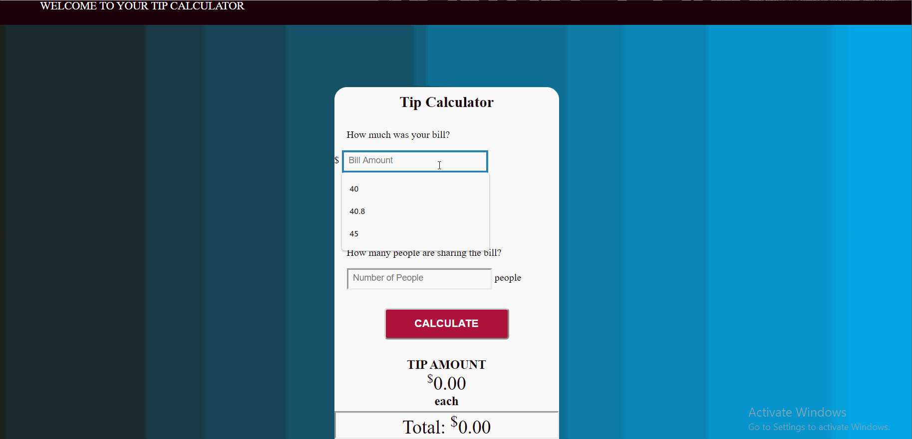

# my-tip-calculator

Author: Mark Kubrak

A simple tipping calculator app where you enter your bill amount, select your tip percentage, the amount of people involved, and you receive the calculated owed amount per person.

## Time spent
Describe the time you spent on the project.
 * Tutorials, research: 4 hours
 * Coding required stories: 1 hour
 * Optional and extras: 1 hours

## User stories

### Required
 * [x] User can enter total bill amount
 * [x] User can choose between at least three tip tiers (e.g. 15%, 18%, 20%) and see the total tip 
 * [x] User can see the total with tip

### Optional

 * [ ] Add custom CSS to the calculator inputs
 * [ ] Add a light/dark color theme toggle on the page
 * [ ] User can enter tax amount
 * [ ] Page is optimized for the viewport/browser size (i.e. scales to mobile & desktop sizes)
 * [ ] Remember the previous bill amount when the user re-opens the browser
 * [ ] Use [locale specific](https://developer.mozilla.org/en-US/docs/Web/JavaScript/Reference/Global_Objects/NumberFormat) currency and currency separators.

### Extra

 User can enter the amount of people participating in tipping and it will give the amount owed for each person.
 

## GIF Walkthrough

Markdown code to embed a GIF in your README file:

GIF created with [LiceCap](https://www.cockos.com/licecap/).

## Notes & shoutouts

This first started with figuring out how to make handle bars work in Ember followed by actions. Then after getting the CSS the way I wanted, I ran into a long issue of figuring out why my total value would return in such a strange way until I realized that it wasn't adding values properly but instead it concatenate them. Overall, putting everything else together was fine.
